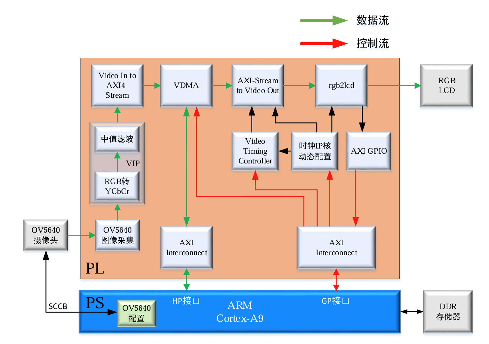

# Cam_to_YUV · FPGA 快速图形识别测试平台（ZYNQ）

基于 **正点原子 领航者 ZYNQ（XC7Z020）** + **Vivado/Vitis 2020.2** 的图像处理测试平台：OV5640 摄像头实时采集 → PL 内图像处理流水线（RGB→YCbCr 灰度等）→ VDMA 三帧缓存写入 DDR3 → RGB LCD 实时回显。

**最终目标**：以 PL 算法链实现快速图形识别——原图像 → 滤波 → RGB 转 HSV → 连通域周长/面积检测 → 形状识别，并把每帧识别到的**区域周长（边长）、颜色、面积**上报 PS 端。



## 平台现状（已在板上跑通）

```
OV5640(DVP 8bit)
  → ov5640_capture_data     采集：RGB565 → RGB888（视频总线 vid_vsync/vid_ce/vid_active_video/vid_data[23:0]）
  → rgb2ycbcr               灰度处理（输出 {Y,Y,Y} 24bit，3 拍流水）
  → v_vid_in_axi4s          native 视频 → AXI4-Stream（异步时钟域）
  → axi_vdma (S2MM)         经 AXI Interconnect/HP0 写入 DDR3（24bit 流、3 帧循环缓存）
  → DDR3 帧缓存区 0x0110_0000
  → axi_vdma (MM2S)         读回
  → v_axi4s_vid_out         AXI4-Stream → RGB888 视频输出（VTC 生成时序）
  → rgb2lcd                 RGB LCD 实时显示（分辨率随 LCD ID 自动适配 480×272~1280×800）
```

PS 端（ARM Cortex-A9，Vitis 应用 `cam_screen`）：EMIO GPIO 软件模拟 SCCB 配置 OV5640、AXI GPIO 读 LCD ID、动态配置像素时钟、UART 打印状态。

## 目录结构

| 路径 | 内容 |
|---|---|
| `doc/` | **完整使用说明 `README.md`**、系统框架图 `sysframework.png`（教材 PDF 为本地配套资料，未入库） |
| `rtl/ip_repo/` | 自定义 IP 源码：`ov5640_capture_data`、`rgb2ycbcr`、`rgb2lcd` |
| `prj/cam_sys/` | Vivado 2020.2 工程：块设计 `cam_sys`（仅 xpr/srcs 源码入库） |
| `prj/cam_screen/src/` | Vitis 应用源码（main.c + 各驱动） |
| `sim/` | 仿真目录（预留） |

> 仓库按“仅源码”策略管理：Vivado/Vitis 全部生成物（综合、比特流、XSA、平台/BSP、.metadata 等）由根目录 `.gitignore` 排除，克隆后按 `doc/README.md` **附录 A** 重建。

## 快速开始（TL;DR）

1. **Vivado 2020.2** 打开 `prj/cam_sys/cam_sys.xpr` → Generate Bitstream → Export Hardware（勾选 Include bitstream）→ `cam_sys_wrapper.xsa`。
2. **Vitis 2020.2** 用该 XSA 创建平台与应用，源码取自 `prj/cam_screen/src`（详见文档附录 A）。
3. 连接 JTAG / USB-UART（115200）/ OV5640 摄像头（镜头朝外）/ RGB LCD，上电运行。
4. 预期：串口打印 `LCD ID: xxx`、`OV5640 detected successful!`；LCD 显示摄像头灰度实时画面。

## 新模块接入（滤波 / HSV / 连通域识别）

教材式 VIP 图像处理模块的标准接法（通读正点原子 Vitis 指南第 30~35 章后整理）：

- **接入位置**：串入 `ov5640_capture_data_0` 与 `v_vid_in_axi4s_0` 之间（处理帧自动入 DDR/回显，PS 软件无需改动）；
- **端口形式**：`clk`/`rst_n` + `vsync`/`clken`/`valid` + `data[23:0]`（RGB888，1 像素/时钟），同步信号随数据延迟打拍对齐；
- **结果上送**：识别模块输出经 AXI-Lite 寄存器组（挂 GP0 总线）按帧上报 PS：区域 周长/颜色/面积/形状类别。

完整规范见 **`doc/README.md` 第 7 章**（接入位置三方案、端口表格、数据流格式、操作 Checklist、教材章节对照）。

## 环境要求

- Vivado / Vitis **2020.2**（工程由 2020.2 建立）
- 正点原子 领航者开发板（XC7Z020）+ OV5640 摄像头 + RGB LCD（4.3″~10.1″）

## 文档

- 详细使用说明：**[doc/README.md](doc/README.md)**
- 系统框架图：`doc/sysframework.png`

## 修订记录

| 日期 | 说明 |
|---|---|
| 2026-09 | 首版：平台使用说明与新模块接入指南（滤波→HSV→连通域周长/面积→形状识别→结果上送 PS） |
